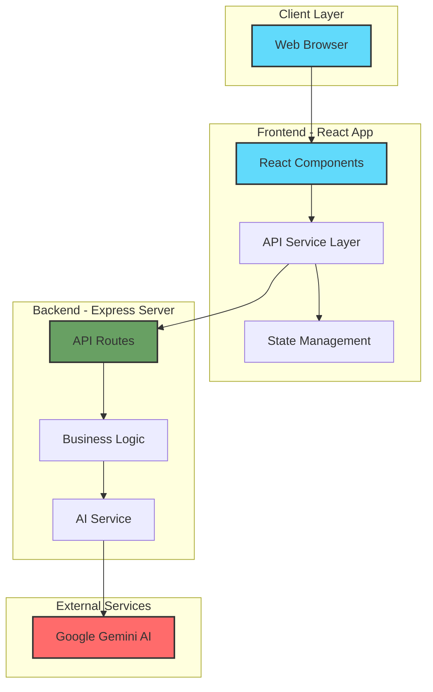
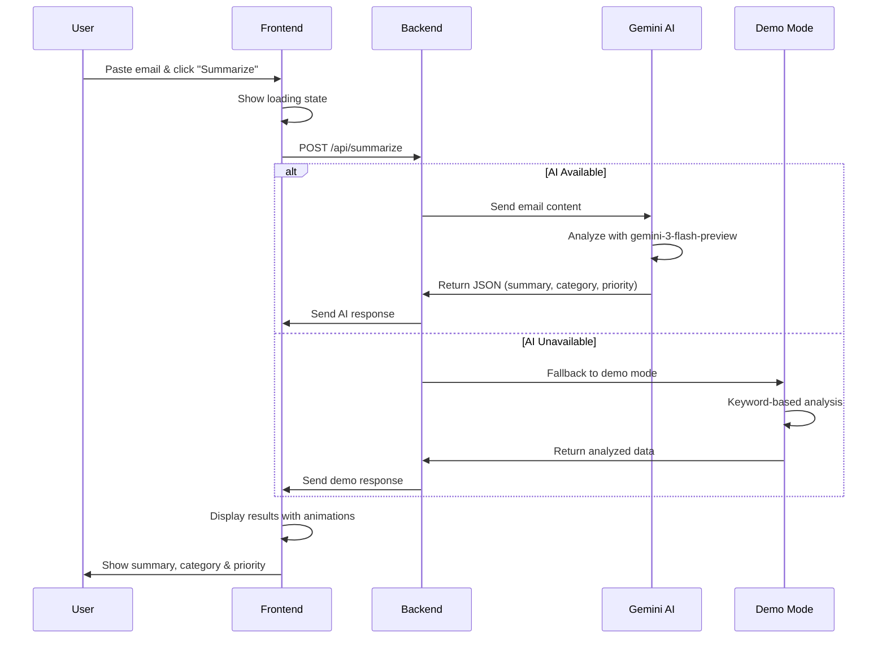
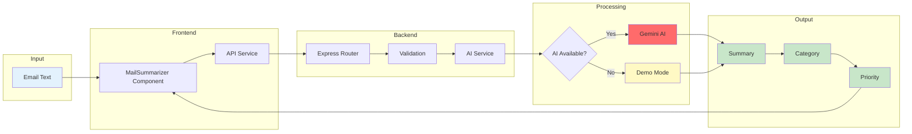
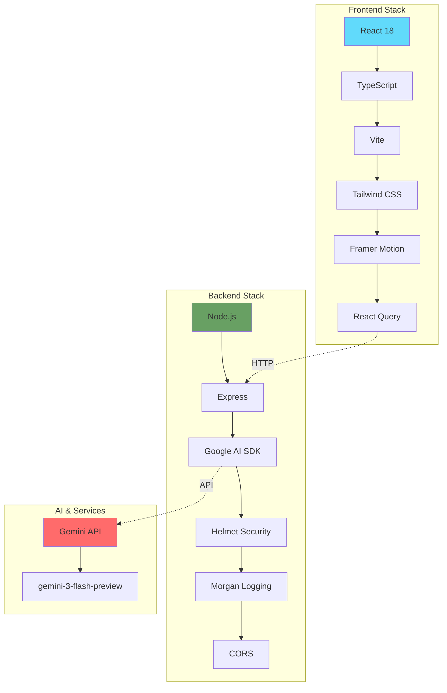

# 🎓 Nexus Campus Hub
> Your all-in-one platform for campus life - bringing together everything students need in one beautiful, intuitive interface.
[](https://reactjs.org/)
[](https://vitejs.dev/)
[](https://ai.google.dev/)
> ## 🧩 Problem Statement Alignment (Hackathon Judges)
Nexus Campus Hub is built specifically for the **AI Fusion Hackathon – Project Nexus** challenge.
## 📚 Full Project Documentation

For a detailed explanation of the system architecture, AI integration, backend APIs, deployment strategy, and design decisions, please refer to the complete project documentation:


👉 **Google Docs:**  
https://docs.google.com/document/d/1NWB1EHaatTffjQyunW-DNPJAI_0leO_7sFX3xqND-Go/edit?usp=sharing
### Core Pillars Covered
✅ Daily Pulse – Live dashboard + AI Mail Summarizer  
✅ Student Exchange – Marketplace, Lost & Found, Travel Sharing (UI flows)  
✅ Explorer’s Guide – Campus & nearby discovery  
✅ Academic Cockpit – Timetable, LMS Lite, Academic planning  

### Technical Requirements Met
✅ Full-stack application (Frontend + Backend)  
✅ AI/ML Component – Mail Summarizer (Gemini AI)  
✅ Real-time interaction – Instant AI responses  
✅ Authentication-ready architecture  
✅ Responsive (Mobile + Desktop)  
✅ Version-controlled & documented  

**Focus:** One fully working intelligent feature + cohesive ecosystem design.

---
## 🏗️ System Architecture
### High-Level Overview

### Mail Summarizer Flow

### Data Flow Architecture

### Technology Stack Diagram

---
## ✨ Key Features
### 🤖 AI-Powered Mail Summarizer
The crown jewel of Nexus Campus Hub! Our intelligent mail summarizer uses Google's Gemini AI to:
- **Understand Context** - Knows the difference between an exam notification and a club event
- **Categorize Smartly** - Automatically tags emails as Academic, Event, Urgent, or General
- **Prioritize for You** - Marks emails as High, Medium, or Low priority
- **Summarize Concisely** - Gives you the key points in 1-2 sentences
**How it works:**
1. Copy any campus email
2. Paste it into the Mail Summarizer
3. Click "Summarize Email"
4. Get instant insights! 🎉
### 🎨 Beautiful, Modern Design
- Smooth animations that feel natural
- Gradient backgrounds that pop
- Responsive design that works on any device
- Dark mode friendly (coming soon!)
### ⚡ Lightning Fast
- Built with Vite for instant hot reload
- Optimized for performance
- Smooth page transitions
- No lag, no waiting
---
## 🚀 Getting Started
### What You'll Need
Before you start, make sure you have:
- **Node.js** (version 16 or higher) - [Download here](https://nodejs.org/)
- **npm** (comes with Node.js)
- A **Google Gemini API key** (for the AI features) - [Get one free](https://ai.google.dev/)
### Quick Setup (5 minutes!)
**Step 1: Get the Code**
```bash
# Clone this repository
git clone <your-repo-url>
cd nexus-campus-hub
```
**Step 2: Install Dependencies**
```bash
# Install frontend dependencies
npm install
# Install backend dependencies
cd server
npm install
cd ..
```
**Step 3: Configure the AI**
```bash
# Go to the server folder
cd server
# Create your environment file
cp .env.example .env
# Open .env and add your Gemini API key
# GEMINI_API_KEY=your_actual_api_key_here
```
**Step 4: Start Everything**
Open two terminal windows:
**Terminal 1 - Frontend:**
```bash
npm run dev
```
**Terminal 2 - Backend:**
```bash
cd server
npm start
```
**Step 5: Open Your Browser**
Go to `http://localhost:8080` and you're ready! 🎉
---
## 🎮 How to Use
### Using the Mail Summarizer
1. **Navigate** to the Daily Pulse page (it's the home page)
2. **Find** the "Mail Summarizer" card
3. **Paste** any campus email into the text box
4. **Click** "Summarize Email"
5. **Watch** the magic happen! ✨
The AI will analyze your email and show you:
- 📝 A concise summary
- 🏷️ Category (Academic/Event/Urgent/General)
- 🎯 Priority level (High/Medium/Low)
### Exploring Other Features
- **Daily Pulse** - Your personalized dashboard
- **Student Exchange** - Connect globally
- **Explorer's Guide** - Discover campus
- **Academic Cockpit** - Manage your studies
---
## 🛠️ Tech Stack
### Frontend
- **React 18** - Modern UI library
- **TypeScript** - Type-safe JavaScript
- **Vite** - Next-generation build tool
- **Tailwind CSS** - Utility-first styling
- **Framer Motion** - Smooth animations
- **shadcn/ui** - Beautiful components
### Backend
- **Node.js** - JavaScript runtime
- **Express** - Web framework
- **Google Gemini AI** - AI-powered analysis
- **Helmet** - Security middleware
- **Morgan** - Request logging
---
## 📁 Project Structure
```
nexus-campus-hub/
├── src/                          # Frontend source code
│   ├── components/               # Reusable UI components
│   │   ├── daily-pulse/         # Daily Pulse components
│   │   │   └── MailSummarizer.tsx  # AI mail summarizer
│   │   ├── layout/              # Layout components
│   │   └── ui/                  # UI primitives
│   ├── pages/                   # Page components
│   ├── services/                # API services
│   └── App.tsx                  # Main app component
│
├── server/                      # Backend server
│   ├── src/
│   │   ├── routes/             # API routes
│   │   ├── services/           # Business logic
│   │   │   └── aiService.js    # Gemini AI integration
│   │   ├── middleware/         # Express middleware
│   │   └── index.js            # Server entry point
│   ├── .env                    # Environment variables
│   └── package.json            # Backend dependencies
│
├── package.json                # Frontend dependencies
└── README.md                   # You are here! 👋
```
---
## 🔧 Configuration
### Environment Variables
**Backend (.env in server folder):**
```env
PORT=3001                        # Backend server port
GEMINI_API_KEY=your_key_here    # Your Gemini API key
NODE_ENV=development            # Environment
CORS_ORIGIN=http://localhost:8080  # Frontend URL
RATE_LIMIT_WINDOW_MS=900000     # Rate limit window
RATE_LIMIT_MAX_REQUESTS=100     # Max requests per window
```
### Getting a Gemini API Key
1. Go to [Google AI Studio](https://ai.google.dev/)
2. Sign in with your Google account
3. Click "Get API Key"
4. Create a new API key
5. Copy it to your `.env` file
**It's free!** Google provides a generous free tier for Gemini API.
---
## 🎯 Features in Detail
### Mail Summarizer Categories
**📅 Academic**
- Course announcements
- Exam schedules
- Assignment deadlines
- Grade notifications
**📢 Event**
- Campus events
- Workshops and seminars
- Club activities
- Competitions
**⚠️ Urgent**
- Time-sensitive deadlines
- Emergency notifications
- Critical announcements
- Last-minute changes
**✉️ General**
- Regular updates
- Information notices
- General announcements
- FYI messages
### Priority Levels
- **🔴 High** - Urgent deadlines, critical information
- **🟡 Medium** - Important but not urgent
- **🟢 Low** - General information, FYI
---
## 🐛 Troubleshooting
### "Failed to fetch" error
**Problem:** Frontend can't connect to backend
**Solution:**
1. Make sure backend is running on port 3001
2. Check that CORS_ORIGIN in `.env` matches your frontend URL
3. Restart both servers
### "API key not valid" error
**Problem:** Gemini API key is incorrect or missing
**Solution:**
1. Check your `.env` file in the `server` folder
2. Make sure `GEMINI_API_KEY` is set correctly
3. Verify the key is valid at [Google AI Studio](https://ai.google.dev/)
4. Restart the backend server
### Demo Mode Activated
**What it means:** The AI service fell back to keyword-based analysis
**Why it happens:**
- Invalid API key
- API quota exceeded
- Network issues
**What to do:**
- Demo mode still works great! It uses intelligent keyword matching
- To use real AI, fix your API key configuration
- Check the backend logs for specific error messages
### Port Already in Use
**Problem:** `EADDRINUSE` error when starting servers
**Solution:**
```bash
# On Windows
netstat -ano | findstr :3001
taskkill /PID <process_id> /F
# On Mac/Linux
lsof -ti:3001 | xargs kill -9
```
---
## 🤝 Contributing
We'd love your help making Nexus Campus Hub even better! Here's how:
1. **Fork** the repository
2. **Create** a new branch (`git checkout -b feature/amazing-feature`)
3. **Make** your changes
4. **Commit** (`git commit -m 'Add some amazing feature'`)
5. **Push** (`git push origin feature/amazing-feature`)
6. **Open** a Pull Request
### Development Guidelines
- Write clean, readable code
- Add comments for complex logic
- Test your changes thoroughly
- Follow the existing code style
- Update documentation if needed
---
## 📝 License
This project is open source and available under the MIT License.
---
## 🙏 Acknowledgments
- **Google Gemini AI** - For powering our intelligent features
- **shadcn/ui** - For beautiful, accessible components
- **Vite Team** - For the amazing build tool
- **React Team** - For the incredible framework
---
## 📞 Support
Having issues? We're here to help!
- 📧 **Email:** support@nexuscampushub.com
- 💬 **Discord:** [Join our community](#)
- 🐛 **Issues:** [GitHub Issues](https://github.com/your-repo/issues)
- 📖 **Docs:** Check out `PROJECT_DOCUMENTATION.md` for detailed guides
---
## 🗺️ Roadmap
### Coming Soon
- [ ] Dark mode support
- [ ] Email integration (connect your inbox)
- [ ] Mobile app (iOS & Android)
- [ ] Calendar integration
- [ ] Study group finder
- [ ] GPA calculator
- [ ] Course recommendations
### In Progress
- [x] AI-powered mail summarizer
- [x] Beautiful, modern UI
- [x] Responsive design
---
## ⭐ Show Your Support
If you find Nexus Campus Hub helpful, please give it a star on GitHub! It helps others discover the project and motivates us to keep improving it.
---
<div align="center">
**Made with ❤️ for students, by students**
[⬆ Back to Top](#-nexus-campus-hub)
</div>
